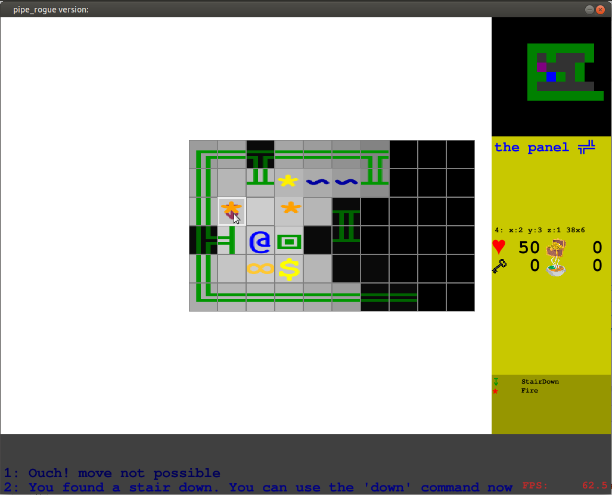

# pipe_rogue
my personal attempt to recreate the roguebasin-tutorials, using python3, pygame and other libs

original roguebasin tutorial is here:
http://www.roguebasin.com/index.php?title=Complete_Roguelike_Tutorial,_using_python%2Blibtcod

## installation

make sure you have python3 and pygame (for python3) properly installed

on linux:

    sudo apt install python3 python3-pip
    sudo pip3 install pygame

## start the game

type:

    python pipe_rogue.py

or:

    python3 pipe_rogue.py